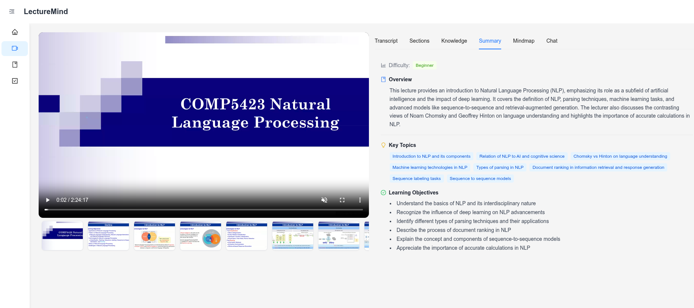

# LectureMind

An AI-powered lecture video analysis and summarization platform. Upload lecture videos and the system automatically transcribes speech, detects slide transitions, performs OCR on slides, extracts structured knowledge, generates concept maps, and provides an intelligent RAG-powered chatbot for Q&A over lecture content.

> **COMP5575** Group Project — PolyU 2026 Spring



---

## Table of Contents

- [Features](#features)
- [Tech Stack](#tech-stack)
- [Quick Start (Docker)](#quick-start-docker)
- [Configuration](#configuration)
- [Manual Setup (Development)](#manual-setup-development)
- [Project Structure](#project-structure)
- [Video-RAG Pipeline](#video-rag-pipeline)
- [API Reference](#api-reference)
- [RAG Evaluation](#rag-evaluation)
- [License](#license)

---

## Features

| Feature | Description |
|---|---|
| **Video Upload & Management** | Drag-and-drop upload, CRUD, course/episode grouping |
| **HLS Adaptive Streaming** | 4-rendition transcoding (1080p/720p/480p/360p) with master playlist |
| **ASR Transcription** | DashScope Qwen3-ASR — sentence-level timestamps, language detection, emotion tags |
| **SSIM Slide Detection** | Multithreaded structural similarity analysis for slide transition detection |
| **Dual-Resolution Thumbnails** | 200 px for web display, 1920 px for high-quality OCR |
| **Slide OCR** | Vision-language model extracts full text from every slide |
| **Hybrid Chunking** | Slide transitions + silence gaps + semantic similarity → intelligent segments |
| **Fine-Grained Knowledge** | Per-section LLM extraction of knowledge points, key terms, importance scores |
| **Coarse-Grained Summary** | Lecture-level summary, chapter outline, learning objectives, difficulty rating |
| **Knowledge Mindmap** | Hierarchical concept map generated by LLM, visualised with ReactFlow |
| **Vector Embeddings** | All content types embedded into ChromaDB for semantic retrieval |
| **RAG Chatbot (3 modes)** | LLM Direct / Fast RAG / Agentic RAG with automatic fallback chains |
| **LangGraph Agent** | Multi-step reasoning with tools: search_knowledge, search_slides, get_transcript_range |
| **Task Monitoring** | Real-time DAG task status dashboard per video |
| **RAG Evaluation CLI** | Automated Q&A generation, 3-mode comparison, hallucination measurement |

---

## Tech Stack

| Layer | Technology |
|---|---|
| **Frontend** | React 19, TypeScript, Ant Design 6, Tailwind CSS |
| **Video Player** | @mux/mux-video-react (HLS adaptive streaming) |
| **Mindmap** | @xyflow/react (ReactFlow) |
| **Backend** | Python 3.11, Django 5.2, Django REST Framework |
| **Production server** | Gunicorn (WSGI) |
| **Frontend server** | nginx 1.27 (Alpine) |
| **ASR** | Alibaba DashScope Qwen3-ASR |
| **LLM** | Qwen series via OpenAI-compatible API (DashScope) |
| **Vision-Language** | Qwen2.5-VL (slide OCR) |
| **Agent Framework** | LangGraph |
| **Embeddings** | sentence-transformers `all-MiniLM-L6-v2` |
| **Vector Database** | ChromaDB (embedded, persistent) |
| **Video/Audio** | FFmpeg, OpenCV, Pillow, scikit-image |
| **Cloud Storage** | Tencent COS (audio hosting for ASR) |
| **Database** | SQLite (single-node) |
| **Deployment** | Docker + Docker Compose |

---

## Quick Start (Docker)

### Prerequisites

- [Docker](https://docs.docker.com/get-docker/) 24+
- [Docker Compose](https://docs.docker.com/compose/) v2.20+
- Alibaba DashScope API key
- Tencent COS bucket (for ASR audio upload)

### 1. Clone and configure

```bash
git clone <repo-url>
cd LectureMind
cp .env.example .env
```

Open `.env` and fill in the required values:

```bash
# Required — LLM and ASR
DASHSCOPE_API_KEY=sk-xxxxxxxxxxxxxxxx
LLM_API_BASE=https://dashscope.aliyuncs.com/compatible-mode/v1

# Required — Tencent COS (audio upload for ASR)
COS_SECRECT_ID=AKIDxxxxxxxx
COS_SECRECT_KEY=xxxxxxxx
COS_REGION=ap-singapore
COS_BUCKET=your-bucket-name

# Recommended — model selection
LLM_MODEL=qwen2.5-7b-instruct
CHAT_MODEL=qwen3-max
VL_MODEL=qwen2.5-vl-72b-instruct
```

### 2. Build and start

```bash
docker compose up --build
```

This builds two images (`lecturemind-backend`, `lecturemind-frontend`) and starts three containers:

| Container | Role | Default port |
|---|---|---|
| `web` | Django API (Gunicorn) | `8000` |
| `worker` | Async task processor | — |
| `frontend` | React SPA (nginx) | `3000` |

Open **http://localhost:3000** in your browser.

### 3. Common Docker operations

```bash
# Start in background
docker compose up -d

# View logs
docker compose logs -f web
docker compose logs -f worker
docker compose logs -f frontend

# Rebuild after code changes
docker compose build
docker compose up -d

# Rebuild a single service
docker compose build web
docker compose up -d web

# Stop everything
docker compose down

# Stop and remove persistent data volume
docker compose down -v
```

### 4. Changing ports

Set `BACKEND_PORT` and/or `FRONTEND_PORT` in `.env`:

```bash
BACKEND_PORT=9000
FRONTEND_PORT=8080
```

Then restart: `docker compose up -d`.

---

## Configuration

All settings are driven by environment variables loaded from `.env`. See [docs/CONFIGURATION.md](docs/CONFIGURATION.md) for the full reference. Key variables:

### Ports

| Variable | Default | Description |
|---|---|---|
| `BACKEND_PORT` | `8000` | Host port for the Django API |
| `FRONTEND_PORT` | `3000` | Host port for the React frontend |

### Storage paths (Docker: all inside the `lecturemind_data` volume at `/data`)

| Variable | Default | Description |
|---|---|---|
| `MEDIA_ROOT` | `<BASE_DIR>/media` | Root for all media files |
| `DB_PATH` | `<BASE_DIR>/db.sqlite3` | SQLite database file |
| `LOG_DIR` | `<BASE_DIR>/logs` | Log directory |
| `CHROMA_PERSIST_DIR` | `<MEDIA_ROOT>/chromadb` | ChromaDB vector store |

### LLM models

| Variable | Default | Description |
|---|---|---|
| `LLM_MODEL` | `qwen2.5-7b-instruct` | Task pipeline model |
| `CHAT_MODEL` | `qwen3-max` | Chat and agentic RAG model |
| `VL_MODEL` | `qwen2.5-vl-72b-instruct` | Slide OCR vision-language model |
| `LLM_API_BASE` | DashScope URL | Any OpenAI-compatible endpoint |

Models can also be changed at runtime without restart via the web UI or API:

```bash
curl -X POST http://localhost:8000/api/config/update/ \
  -H "Content-Type: application/json" \
  -d '{"key": "chat_model", "value": "qwen-turbo"}'
```

---

## Manual Setup (Development)

Use this if you want to run backend and frontend directly without Docker.

### Prerequisites

- Python 3.10+ with conda or pip
- Node.js 20+ with pnpm
- FFmpeg installed system-wide (`ffmpeg -version`)

### Backend

```bash
# 1. Create environment
cd server
conda env create -f environment.yml
conda activate LectureMind
# or: pip install -r requirements.txt

# 2. Configure
cd ..
cp .env.example .env
# fill in DASHSCOPE_API_KEY, COS_*, etc.

# 3. Migrate database
cd server/app
python manage.py migrate

# 4. Start API server (terminal 1)
python manage.py runserver
# Port defaults to BACKEND_PORT env var (default 8000)

# 5. Start task processor (terminal 2)
python manage.py process_async_task
```

### Frontend

```bash
cd frontend
pnpm install
pnpm start        # dev server on http://localhost:3000
```

The dev frontend reads `frontend/public/env-config.js` for the API URL:

```js
// frontend/public/env-config.js
window.__ENV__ = { API_PREFIX: "http://127.0.0.1:8000" };
```

Edit this file if your backend runs on a different host or port.

---

## Project Structure

```
LectureMind/
├── docker-compose.yml               # 3-service orchestration
├── .env.example                     # All configurable variables with defaults
├── .env                             # Your local config (gitignored)
│
├── server/
│   ├── Dockerfile                   # 2-stage: builder + python:3.11-slim + FFmpeg
│   ├── docker-entrypoint.sh         # migrate → collectstatic → web|worker
│   ├── requirements.txt             # Python deps (incl. gunicorn)
│   ├── environment.yml              # Conda environment
│   └── app/
│       ├── manage.py
│       ├── videoapp/
│       │   ├── settings.py          # All paths/ports from env vars
│       │   └── urls.py
│       └── api/
│           ├── models.py            # All Django models
│           ├── views.py             # DRF API views
│           ├── tasks.py             # Async task implementations + TASK_REGISTRY
│           ├── agent_graph.py       # LangGraph agentic RAG
│           ├── agent_tools.py       # Agent tools
│           ├── rag_engine.py        # Fast RAG engine
│           ├── vector_store.py      # ChromaDB abstraction
│           ├── dashscope_asr.py     # ASR client
│           ├── lecture_video_slides_chunker.py
│           ├── lecture_video_hybrid_chunker.py
│           ├── evaluate/            # RAG evaluation module
│           └── management/commands/
│               ├── process_async_task.py
│               ├── evaluate_rag.py
│               └── runserver.py     # Respects BACKEND_PORT env
│
├── frontend/
│   ├── Dockerfile                   # 2-stage: node builder + nginx:1.27-alpine
│   ├── docker-entrypoint.sh         # writes env-config.js → starts nginx
│   ├── nginx/default.conf
│   ├── public/
│   │   ├── index.html
│   │   └── env-config.js            # Runtime API URL (overwritten in Docker)
│   └── src/
│       ├── config.ts                # API_PREFIX from window.__ENV__
│       ├── MainLayout.tsx
│       ├── page/
│       └── components/
│
└── docs/
    ├── ARCHITECTURE.md              # System architecture reference
    ├── CONFIGURATION.md             # Full configuration reference
    └── RAG_EVALUATION.md            # Evaluation module documentation
```

---

## Video-RAG Pipeline

After a video is uploaded, the async task processor runs this DAG automatically:

```
Upload Video
     │
     ├──→ ASR Transcription        (DashScope Qwen3-ASR via Tencent COS)
     ├──→ HLS Encoding             (FFmpeg → 4 renditions)
     └──→ SSIM Slide Detection     (multithreaded frame comparison)
               │
               └──→ Thumbnail Generation
                    (200px web + 1920px OCR, saved to MEDIA_THUMBNAILS_DIR)
                         │
                         └──→ Slide OCR
                              (VL model on high-res thumbnails → SlideOCR)
                                   │
                                   └──→ Hybrid Chunking
                                        (slide + silence + semantic → VideoSection)
                                             │
                                    ┌────────┼────────┬────────────┐
                                    │        │        │            │
                              Fine-Grained  Coarse  Mindmap   Embed
                              Knowledge   Summary   Gen.    Knowledge
                              (KP + terms) (summary) (JSON)  (→ChromaDB)
```

---

## API Reference

All endpoints prefixed with `/api/`.

### Videos

| Method | Endpoint | Description |
|---|---|---|
| `GET` | `/api/videos/` | List all videos |
| `POST` | `/api/videos/upload/` | Upload video (multipart/form-data) |
| `GET` | `/api/videos/<uuid>/` | Get video details |
| `PATCH` | `/api/videos/update/<uuid>/` | Update video metadata |
| `DELETE` | `/api/videos/delete/<uuid>/` | Delete video and all related data |
| `GET` | `/api/videos/<uuid>/thumbnails/` | List slide thumbnails |
| `GET` | `/api/videos/<uuid>/transcript/` | ASR transcript with sentence timestamps |
| `GET` | `/api/videos/<uuid>/sections/` | Hybrid-chunker segments/chapters |
| `GET` | `/api/videos/<uuid>/knowledge/` | Fine-grained knowledge points |
| `GET` | `/api/videos/<uuid>/summary/` | Coarse-grained lecture summary |
| `GET` | `/api/videos/<uuid>/mindmap/` | Knowledge mindmap JSON |

### Chat

| Method | Endpoint | Description |
|---|---|---|
| `POST` | `/api/chat/` | Create chat session |
| `POST` | `/api/chat/<uuid>/message/` | Send message, get SSE streaming response |
| `GET` | `/api/chat/<uuid>/messages/` | Get chat history |

### Tasks & System

| Method | Endpoint | Description |
|---|---|---|
| `GET` | `/api/tasks/video/<uuid>/` | Task status for a video |
| `GET` | `/api/config/` | List runtime configuration (secrets masked) |
| `POST` | `/api/config/update/` | Update configuration at runtime |
| `POST` | `/api/config/sync-from-env/` | Sync `.env` file → database |
| `GET` | `/api/health/` | Health check |

### Episodes (Courses)

| Method | Endpoint | Description |
|---|---|---|
| `GET` | `/api/episodes/` | List all episodes |
| `POST` | `/api/episodes/new/` | Create episode |
| `GET` | `/api/episodes/<uuid>/` | Get episode with nested videos |
| `PATCH` | `/api/episodes/update/<uuid>/` | Update episode |
| `DELETE` | `/api/episodes/delete/<uuid>/` | Delete episode |

---

## RAG Evaluation

The evaluation CLI compares the three RAG modes on a video's knowledge base:

```bash
cd server/app

# Basic: 20 auto-generated questions
python manage.py evaluate_rag --video <uuid> --questions 20

# With custom questions (remainder auto-generated to reach --question_count)
python manage.py evaluate_rag \
    --video <uuid> \
    --question "Who are the tutors?,What is the grading policy?" \
    --question_count 10

# Custom models and output formats
python manage.py evaluate_rag \
    --video <uuid> \
    --sota-model qwen3.6-plus \
    --test-model qwen-turbo \
    --formats json,csv,md,html \
    --output ./evaluation_reports/
```

Reports are saved to `./evaluation_reports/` with JSON, CSV, Markdown, and HTML formats.
See [docs/RAG_EVALUATION.md](docs/RAG_EVALUATION.md) for full details.

---

## License

Apache License 2.0 — see [LICENSE](LICENSE) for details.
