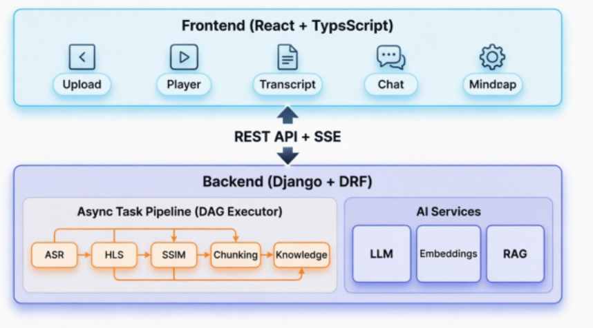
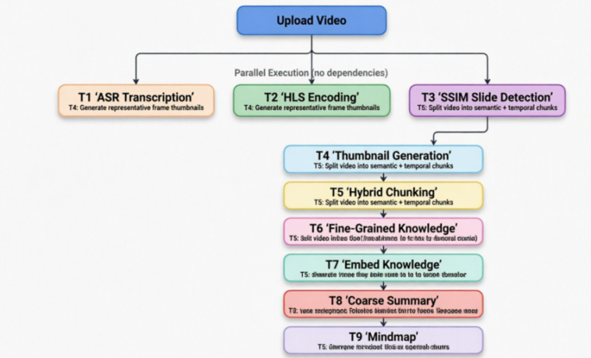
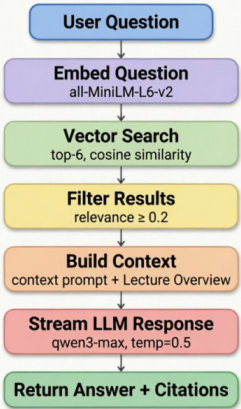
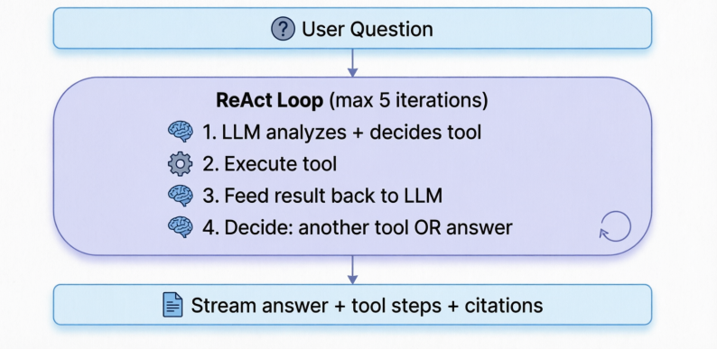

<style>
    .bottom-right {
    position: absolute;
    right: 0px;
    bottom: 20px;
    width: 50%;
  }
</style>


<!-- _class: lead -->

# LectureMind: AI-Powered Lecture Video Analysis

> *COMP5575 Group Project*

 - *Speaker_A* 
 - *Speaker_B*
 - *Speaker_C*


<!--
Speaker Notes:
Good evening everyone. Today we present LectureMind, an AI-powered lecture video analysis and summarization platform.
-->

---

# What is LectureMind?

**Problem:** Students struggle to navigate and review long lecture videos

**Solution:** Multi-stage AI pipeline that transforms raw lecture videos into:
- Structured segments with slide transitions
- Transcribed text with timestamps
- Extracted knowledge points
- Searchable knowledge base
- Intelligent Q&A chatbot

<!--
Speaker Notes:
LectureMind addresses a common problem: students find it difficult to efficiently review long lecture videos. Our system automatically processes lecture videos through a AI pipeline. The output includes segmented content, transcripts, extracted knowledge points, and a chatbot that can answer questions about the lecture content. This transforms passive video watching into an interactive learning experience.
-->

---
# Demo Video

TODO::

---

# System Architecture Overview



<!--
Speaker Notes:
Our project has a classic B-S architecture. The frontend is built with React and TypeScript, providing interfaces for video upload, playback, transcript viewing, chatbot interaction, and mindmap visualization. The backend uses Django with Django REST Framework. The core intelligence lies in our async task pipeline, which processes videos through a directed acyclic graph of tasks. This allows parallel execution where possible and proper dependency management.
-->

---

# Video Processing Pipeline (Task DAG)



<!--
Speaker Notes:
This is the heart of our system - a 10-task directed acyclic graph. 
Tasks 1, 2, and 3 run in parallel since they have no dependencies. 
T1 extracts audio and transcribes using Alibaba's DashScope Qwen3-ASR. 
T2 creates HLS streaming files for adaptive playback. 
T3 detects slide transitions using SSIM analysis. 
Once T3 completes, T4 generates dual-resolution thumbnails: 200px for web display and 1920px for high-quality OCR. 
T5 performs Slide OCR using the high-resolution images to extract text from slide content. 
T6 then performs hybrid chunking, combining slide transitions with silence detection to create meaningful sections. 
The remaining tasks T7 through T10 form a sequential chain for AI-powered knowledge extraction, embedding, summarization, and mindmap generation.
-->

---

# Algorithm 1: SSIM Slide Detection

**Purpose:** Detect slide transitions by analyzing frame-to-frame visual changes

**Structural Similarity Index (SSIM):**
- Measures perceived visual similarity between two images
- Range: 0 (completely different) to 1 (identical)
- Threshold: < 0.7 indicates a slide change

<!--
Speaker Notes:
Let me dive into our first key algorithm: SSIM-based slide detection. SSIM, or Structural Similarity Index, is a perceptual metric that measures image quality degradation. It's more aligned with human visual perception than simple pixel difference. 
-->

---

# Algorithm 1: SSIM Slide Detection

**Processing Pipeline:**
1. **Frame Sampling:** Read frames at 10 FPS (reduces 36K frames vs 1.8M at 30 FPS)
2. **Preprocessing:** Resize to 240px width, convert to grayscale
3. **SSIM Computation:** Multithreaded comparison (16 workers)
4. **Change Detection:** SSIM < threshold → record timestamp
5. **Cooldown:** Minimum 5-second interval between detections

<!--
Speaker Notes:
We sample frames at 10 FPS to balance accuracy with performance. Each frame is resized and converted to grayscale to reduce computational load. We implement multithreaded SSIM computation using 16 worker threads, which significantly speeds up processing. We also implement a 5-second cooldown to prevent false positives from animations or video transitions.
-->

---

# Algorithm 2: Hybrid Video Chunking

**Purpose:** Segment video into meaningful sections using multiple signals

**Three Signal Sources:**

1. **Slide Changes** (from SSIM detection)
   - Physical slide transitions
2. **Silence Gaps** (from ASR transcript)
   - Gaps ≥ 2.0 seconds between sentences
   - Indicates natural pause points
3. **Semantic Similarity** (optional, currently disabled)
   - Sentence-transformers analysis
   - Detects topic shifts in continuous speech

<!--
Speaker Notes:
Hybrid chunking is where our system gets intelligent about segmentation. Instead of relying on a single signal, we combine three complementary approaches. 

Slide changes give us physical boundaries. 
Silence gaps from the ASR transcript indicate natural speaking pauses. 
We also implemented semantic similarity analysis using sentence-transformers.
-->

---

# Algorithm 2: Hybrid Video Chunking

**Algorithm:**
```
Candidates = SlideChanges ∪ SilenceGaps
         │
         ▼
Filter by min_chunk_duration (≥30s)
         │
         ▼
(Optional) Semantic similarity check
         │
         ▼
Build final chunks with start/end times
```


<!--
Speaker Note:
The algorithm merges all candidate split points, filters them by minimum duration, optionally checks semantic continuity, and produces the final section boundaries. This hybrid approach produces much more natural segments than any single method alone.
-->
---

# Hybrid Chunking Example

**Input:**
```
SSIM slide changes: [10.2, 34.5, 78.9, 120.0, 180.5]
ASR silence gaps:   [33.0, 77.5, 118.0, 250.0]
Merged Candidates:  [10.2, 33.0, 34.5, 77.5, 78.9, 118.0, 120.0, 180.5, 250.0]
After Filtering (min 30s duration): Remove 33.0 (too close to 34.5), 77.5 (too close to 78.9), 118.0 (too close to 120.0)
```

**Final Sections:**
```
Section 1: 0.0s - 34.5s    (Introduction)
Section 2: 34.5s - 78.9s   (Background)
Section 3: 78.9s - 120.0s  (Core Concept A)
Section 4: 120.0s - 180.5s (Core Concept B)
Section 5: 180.5s - end    (Summary)
```

<!--
Speaker Notes:
Here's a concrete example of how hybrid chunking works. We start with slide change timestamps from SSIM and silence gap midpoints from the ASR transcript. After merging and sorting, we apply the minimum duration filter - in this case, removing candidates that are too close together. The result is a set of well-spaced, meaningful sections. Each section typically corresponds to a coherent topic or concept in the lecture. These sections become the foundation for all downstream knowledge extraction.
-->

---

# Knowledge Extraction Pipeline

1. Extract transcript text (from ASR), save to sqlite and chromadb
2. Do Hybrid Chunking (Slides Changes + Silence Gaps + Semantic Similarity)
3. Call LLM (**Qwen2.5-7b-instruct**) to generate knowledge points in JSON
 - Prompt: *"Extract knowledge points from this lecture segment. {section text}"*
```json
{
     "section_title": "Gradient Descent Basics",
     "points": [{
          "title": "Learning Rate",
          "summary": "The learning rate controls step size...",
          "terms": ["learning rate", "gradient", "convergence"],
     ...}]}
```
4. Save KnowledgePoint records to sqlite and chromadb


<!--
Speaker Notes:
Once we have our sections, we extract structured knowledge using LLMs. For each section, we send the transcript text to Qwen2.5-7b-instruct with a carefully crafted prompt. The LLM returns structured JSON with a descriptive section title and 1-5 knowledge points. Each knowledge point includes a title, summary explanation, key terminology, and an importance score. This structured output is then saved to our database. The beauty of this approach is that it transforms unstructured speech into organized, searchable knowledge.
-->

---

<!-- _class: lead -->

# Part 2: Knowledge Storage & RAG System

## Speaker 2

<!--
Speaker Notes:
Now I'll hand it over to my teammate who will discuss how we store this extracted knowledge and build our RAG system for intelligent querying.
-->

---

# Vector Database Design

**What Gets Embedded:**

| Content Type | Source | Embed Text Format | Count/Video |
|-------------|--------|-------------------|-------------|
| Knowledge Points | LLM extraction | `"Title: Summary (Key terms: t1, t2)"` | 15-40 |
| Section Transcripts | ASR output | First 2000 chars of transcript | 5-15 |

**Embedding Model:** `all-MiniLM-L6-v2`
- 384 dim vector
- Cosine similarity

<!--
Speaker Notes:
My presentation focuses on how we store and retrieve knowledge.

We embed two types of content: the structured knowledge points extracted by the LLM, and raw section transcripts. The embedding model is all-MiniLM-L6-v2, a lightweight but effective sentence transformer that produces 384-dimensional vectors. 
-->

---

# Knowledge Store Architecture

**Document Metadata Schema:**

```json
{
  "video_id": "uuid",
  "section_id": "uuid",
  "type": "knowledge_point",
  "title": "Gradient Descent Basics",
  "begin_time": 120.5,
  "end_time": 180.0,
  "importance": 0.85
}
```

<!--
Speaker Notes:
Each document in our vector store includes rich metadata. This enables filtered retrieval
-->

---

# Knowledge Store Architecture

**Upsert (during processing):**
```python
store.upsert(
    id="kp-uuid",
    text="Gradient Descent: Optimization algorithm...",
    metadata={...}
)
```

**Query (at chat time):**
```python
results = store.query(
    query_text="What is backpropagation?",
    video_id="uuid",
    top_k=5
)
# Returns: [{id, text, metadata, distance, relevance}]
```

<!--
Speaker Notes:
For example, searching within a specific video or filtering by content type. The upsert operation happens during the async task pipeline, specifically in task 7 (embed knowledge). At chat time, we query the vector store with the user's question, scoped to the relevant video. Results include both the embedding distance and a computed relevance score. This metadata is crucial for building proper citations in our chatbot responses.
-->

---

# RAG Engine: Three-Mode Architecture

| Mode | Description | Fallback |
|------|-------------|---------|
| **LLM Direct** | Pure LLM — no retrieval | — |
| **Fast RAG** | Single-pass vector retrieval | → LLM Direct (if quality < threshold) |
| **Agentic RAG** | Multi-step ReAct agent | → Fast RAG → LLM Direct |

**Quality Gates (Fast RAG fallback triggers when):**
- Relevance score < 0.3 for all retrieved docs
- Fewer than 2 documents pass the relevance filter

<!--
Speaker Notes:
Our RAG system now implements three distinct modes. LLM Direct is the baseline — no retrieval, pure model knowledge. Fast RAG does single-shot vector retrieval and falls back to LLM Direct if retrieved documents are not relevant enough. Agentic RAG uses the full ReAct loop with multiple tools and will fall back through Fast RAG to LLM Direct if needed. This cascading fallback ensures the system always returns a useful answer rather than failing silently.
-->

---

# Slide OCR: High-Resolution Image Pipeline

**Purpose:** Extract text from lecture slides for richer search context

**Dual-Resolution Thumbnails:**
- `image` (200px) — fast web display
- `image_high_res` (1920px) — high-quality OCR input

**OCR Pipeline:**
```
High-res thumbnail (1920px)
         │
         ▼
Qwen-VL multimodal LLM
         │
         ▼
SlideOCR record (text + video_id + timestamp)
         │
         ▼
search_slides() agent tool
```

**Impact on Agentic RAG:**
- Agent can now search *what is written on slides* (equations, bullet points, diagrams)
- Complements `search_knowledge` (semantic search on extracted knowledge points)

<!--
Speaker Notes:
A key enhancement we made is slide OCR. Previously we detected slide transitions and generated thumbnails, but we never read the actual slide content. Now we generate two sizes: a small 200px image for fast web rendering, and a full 1920px image specifically for OCR. We feed the high-res image to a multimodal LLM to extract the slide text. The resulting SlideOCR records are accessible to the agentic RAG system via the search_slides tool, allowing the agent to find content that appears on slides but may not be in the transcript — like equations, diagrams, or bullet lists.
-->

---

# RAG System: Quick RAG Pipeline

<div class="bottom-right"></div>

```
You are a knowledgeable teaching assistant for a video lecture.
Answer the student's question based on the lecture content provided.

Instructions:
- Answer ONLY based on the provided context
- Cite sources using [Source N] notation
- Be concise but thorough, use markdown formatting
- Maintain an educational, helpful tone

Video: {video_title}

Lecture Overview: {summary_section}

Retrieved Sources:
[Source 1] (knowledge_point) "Gradient Descent" [02:00-03:00] (relevance: 0.85)
Gradient descent is an optimization algorithm...

[Source 2] (section_transcript) "Learning Rate" [05:00-06:30] (relevance: 0.72)
The learning rate controls the step size...

Student Question: {question}
```

<!--
Speaker Notes:
Our RAG system operates in two modes. Quick RAG Mode and Agentic Mode.

Quick RAG is a single-shot retrieval and generation pipeline, perfect for factual questions with clear answers in the lecture. 

In Quick RAG, we embed the question, search the vector store, filter low-relevance results, and build a context-augmented prompt. We also inject the lecture summary as background context. The LLM then generates a grounded answer with citations. The entire process takes 2-5 seconds with streaming.
-->

---

# Agent System: ReAct Multi-Step Reasoning

**For complex questions requiring multiple information sources:**



<!--
Speaker Notes:
The Agent mode implements a ReAct loop - Reasoning plus Acting. Instead of a single retrieval, the LLM can iteratively consult different tools. This architecture enables sophisticated reasoning that simple RAG cannot achieve.
-->

---

# Agent System: ReAct Multi-Step Reasoning

**Available Tools:**
- `search_knowledge(query)` - Vector search on knowledge points & transcripts
- `search_slides(query)` - OCR-text search on slide content
- `get_section_details(section_order)` - Full section content
- `get_lecture_summary()` - Overview + chapters
- `list_sections()` - All section titles/times
- `get_transcript_at_time(start, end)` - Transcript slice


---

# Agent Execution Example

**Question:** *"How does the lecture explain the relationship between learning rate and convergence?"*

**Execution Trace:**
```
Step 1: thinking — "Analyzing question (step 1)..."
Step 2: tool_call — search_knowledge(query="learning rate convergence")
Step 3: tool_result — "[Result 1] (knowledge_point) 'Learning Rate...' ..."
Step 4: thinking — "Analyzing question (step 2)..."
Step 5: tool_call — get_section_details(section_order=3)
Step 6: tool_result — "## Section 3: Optimization Techniques..."
Step 7: thinking — "Composing answer..."
Step 8-N: token — "The lecture explains that the learning rate..."
Final: citations — [{source_num: 1, title: "Learning Rate", begin_time: 180, ...}]
Final: done — {tool_steps: [...]}
```

<!--
Speaker Notes:
Here's a real execution trace. The agent first calls search_knowledge to find relevant content about learning rate and convergence. After seeing the results, it decides to get more detailed information from a specific section. Only after gathering sufficient context does it compose the final answer. 
-->

---

<!-- _class: lead -->

# Part 3: Implementation & Results

## Speaker 3

<!--
Speaker Notes:
My teammate will now discuss our implementation details, challenges we faced, and the results we've achieved.
-->

---

# Async Task Pipeline Architecture

**DAG Executor with Dependency Resolution:**

```python
class AsyncTaskItem(models.Model):
    task_type = CharField(...)  # e.g., "task_ssim_move_detection"
    status = CharField(...)     # pending, running, success, error
    previous = ForeignKey(...)  # Dependency (null = no deps)
    input_data = JSONField()
    result_data = JSONField()
    error_message = TextField()
```

**Task Processor:**
- Polls every 5 seconds for pending tasks
- Chains outputs: `task[n].result` → `task[n+1].input`
- Cascade failure: downstream tasks auto-marked as error

<!--
Speaker Notes:
Our async task pipeline is a custom DAG executor built on Django. Each task record includes its type, status, dependency reference, and data payloads. The task processor is a management command that runs continuously, polling for pending tasks whose dependencies are satisfied. When a task completes, its result is automatically merged into the next task's input. If a task fails, all downstream tasks are marked with cascade failure, preventing wasted computation. Failed tasks can be retried, which also resets all blocked descendants.
-->

---

# LLM Integration: Qwen Family

**Models Used:**

| Task | Model | Temperature | Purpose |
|------|-------|-------------|---------|
| ASR Transcription | Qwen3-ASR | N/A | Speech-to-text |
| Knowledge Extraction | qwen2.5-7b-instruct | 0.3 | Structured JSON |
| Coarse Summary | qwen2.5-7b-instruct | 0.5 | Lecture overview |
| Mindmap Generation | qwen2.5-7b-instruct | 0.5 | Hierarchy structure |
| RAG Answer | qwen3-max | 0.5 | Grounded response |
| Agent Reasoning | qwen3-max | 0.3 | Tool selection |


<!--
Speaker Notes:
We leverage multiple models from Alibaba's Qwen family, each selected for its strengths. Qwen3-ASR handles speech recognition with sentence-level timestamps. For knowledge extraction and summarization, we use qwen2.5-7b-instruct - a good balance of capability and cost. For RAG answers and agent reasoning, we use qwen3-max, the most capable model with excellent function-calling support. 

Temperature is tuned per task: lower for structured output (0.3), higher for creative generation (0.5). Our LLM client provides a clean abstraction with OpenAI-compatible APIs, making it easy to swap models if needed.
-->

---

# Mindmap Generation

**Purpose:** Visual hierarchy of lecture concepts

KnowledgePoints grouped by section feed to LLM: *Build hierarchical concept map*
```json
{
  "root": {
    "id": "root",
    "label": "Introduction to Machine Learning",
    "children": [
      {
        "id": "ch1",
        "label": "Supervised Learning",
        "time_range": [0, 600],
        "children": [
          {"id": "kp1", "label": "Linear Regression", "time_range": [60, 180]},
          {"id": "kp2", "label": "Classification", "time_range": [180, 360]}
        ]}]}
}
```

<!--
Speaker Notes:
The mindmap provides a visual overview of the lecture's concept hierarchy. We gather the chapter outline from the coarse-grained summary and all knowledge points grouped by section. The LLM is prompted to build a hierarchical tree structure with nodes labeled by concept names and annotated with time ranges. This JSON structure is then rendered in the frontend using React Flow, an interactive graph visualization library. Students can click any node to seek to the relevant video timestamp, zoom and pan for large maps, and collapse/expand branches. This transforms the linear video into an explorable knowledge graph.
-->

---

# RAG Evaluation: Automated LLM-as-Judge

**Setup:** 9 questions × 3 modes · Judge: qwen3.6-plus · Test model: qwen-turbo

| Mode | Avg Score | Accuracy | Completeness | Hallucination | Avg Latency |
|------|-----------|----------|--------------|---------------|-------------|
| LLM Direct | 69.4 | 66.7% | 66.7% | **0.0%** | 2866 ms |
| Fast RAG | 71.8 | 71.7% | 68.3% | **0.0%** | 4767 ms |
| **Agentic RAG** | **74.2** | **72.8%** | **71.1%** | 11.1% | 5227 ms |

**Key Findings:**
- Agentic RAG achieves the **highest overall score** (+4.8 pts over LLM Direct)
- Fast RAG **eliminates hallucinations** entirely (0%) — conservative but reliable
- Agentic RAG hallucinates on "INSUFFICIENT\_INFO" questions (fabricates details not in slides)
- On **factual questions**, RAG modes dominate: Fast RAG 100/100, Agentic RAG 95/100 vs LLM Direct 5/100
- On **irrelevant questions**, all modes correctly decline (score 100)

<!--
Speaker Notes:
We ran an automated RAG evaluation using 9 questions across three modes. The judge LLM scores each answer against a ground truth on accuracy, completeness, and hallucination. Results are clear: Agentic RAG has the highest average score across all question types, but it hallucinates on questions where the answer isn't in the lecture — it makes up specific details rather than saying "I don't know." Fast RAG is more conservative: it falls back to general knowledge when retrieval quality is poor, which avoids hallucination but can reduce completeness. The sweet spot depends on the use case: factual lookups favor RAG modes, broad conceptual questions can be handled by any mode.
-->

---

# Deployment: Docker Compose Architecture

**Three-container setup with shared persistent volume:**

```
┌─────────────────────────────────────────────────────┐
│  lecturemind_data (Docker volume at /data)          │
│  /data/db.sqlite3  /data/media/  /data/logs/        │
└────────────┬──────────────────────────┬─────────────┘
             │                          │
    ┌────────▼─────────┐    ┌───────────▼──────────┐
    │  web (Gunicorn)  │    │  worker               │
    │  Django REST API │    │  process_async_task   │
    │  :8000           │    │  (same image)         │
    └──────────────────┘    └──────────────────────┘

    ┌────────────────────────────────┐
    │  frontend (nginx)              │
    │  React SPA · runtime env-cfg   │
    │  :3000                         │
    └────────────────────────────────┘
```

```bash
cp .env.example .env   # configure API keys & paths
docker compose up --build
```

<!--
Speaker Notes:
For production deployment, we containerized the entire stack with Docker Compose. The backend image serves dual purpose: the web container runs Gunicorn for the REST API, and the worker container runs the async task processor — same image, different SERVICE environment variable. Both share a named Docker volume for SQLite, media files, ChromaDB, and logs. The React frontend is served by nginx, which also injects runtime configuration so the API URL can be changed without rebuilding the image. All paths and ports are configurable via environment variables in a .env file.
-->

---

# Technical Challenges & Solutions

| Challenge | Solution |
|-----------|----------|
| **Memory constraints** (8GB systems) | Disabled semantic similarity check in chunking |
| **LLM JSON parsing errors** | Robust parser handles fenced JSON, embedded JSON, raw JSON |
| **Long video processing** | Frame sampling at 10 FPS, multithreaded SSIM |
| **Grounded RAG answers** | Strict system prompt + relevance filtering + citations |
| **Agent hallucination** | Fallback chain: Agentic → Fast RAG → LLM Direct |
| **OCR quality on slides** | Dual-res thumbnails: 200px web + 1920px OCR |
| **Runtime config without rebuild** | nginx writes `env-config.js` from env vars at container start |

<!--
Speaker Notes:
We faced several technical challenges during development. Memory constraints on 8GB systems forced us to disable the semantic similarity check in hybrid chunking. LLM responses sometimes included markdown fencing or prose around the JSON, so we built a robust parser that handles multiple formats. Cascade failures in the DAG were problematic early on, but we implemented automatic error propagation and a retry mechanism that resets all blocked descendants. Long videos were addressed through frame sampling and multithreading. Finally, ensuring RAG answers are grounded in the lecture content required careful prompt engineering and relevance filtering.
-->

---

# Future Work

**Planned Enhancements:**

1. **Multi-video Course RAG**
   - Cross-lecture queries: "Compare gradient descent in Lectures 1 and 3"
   - Course-level knowledge aggregation

2. **Improved Chunking**
   - Re-enable semantic similarity with optimized model
   - Speaker change detection for multi-instructor lectures

3. **Enhanced Agent Tools**
   - `compare_concepts(concept_a, concept_b)` - Direct comparison tool
   - `summarize_range(video_id, start, end)` - On-demand summarization

4. **Production Hardening**
   - PostgreSQL migration (from SQLite) for concurrent access
   - User authentication & authorization
   - Load-balanced multi-worker Gunicorn deployment

<!--
Speaker Notes:
Looking ahead, we have several exciting enhancements planned. Multi-video course RAG will enable cross-lecture queries, allowing students to compare how concepts are explained across different lectures. We plan to re-enable semantic similarity chunking with a more memory-efficient model. The agent system will gain new tools for direct concept comparison and on-demand summarization of specific time ranges. For production deployment, we'll migrate from SQLite to PostgreSQL for better concurrent write support, containerize with Docker Compose, and add user authentication. These improvements will make LectureMind a robust, production-ready educational platform.
-->

---

# Summary

**LectureMind transforms lecture videos into interactive learning experiences through:**

1. **Automated Preprocessing**
   - SSIM slide detection (multithreaded, 10 FPS sampling)
   - Hybrid chunking (slide + silence signals)
   - ASR transcription with sentence-level timestamps
   - Dual-resolution thumbnails + Slide OCR (1920px → text)
2. **AI Knowledge Extraction**
   - Fine-grained: Per-section knowledge points via LLM
   - Coarse-grained: Lecture-level summaries and chapters
   - Mindmap: Hierarchical concept visualization (ReactFlow)
3. **Intelligent Q&A — Three RAG Modes**
   - Fast RAG: single-pass retrieval, 0% hallucination
   - Agentic RAG: multi-step ReAct with 6 tools, best overall score (74.2)
   - Cascading fallback ensures reliable answers
4. **Production-Ready Deployment**
   - Docker Compose: web + worker + frontend containers
   - All paths/ports configurable via `.env`

<!--
Speaker Notes:
To summarize, LectureMind now covers the full lifecycle from raw video to interactive Q&A. Our 10-task pipeline handles transcription, slide detection, OCR, and knowledge extraction. The dual-resolution thumbnail pipeline feeds both web display and high-quality OCR. Our three-mode RAG system — evaluated with an automated LLM judge — shows Agentic RAG achieves the highest quality while Fast RAG provides the most reliable, hallucination-free answers. The entire system is containerized with Docker Compose and fully configurable via environment variables.
-->

---

# Thank you! 
# Questions?

<!--
Speaker Notes:
Thank you for your attention. We're happy to take any questions.
-->
